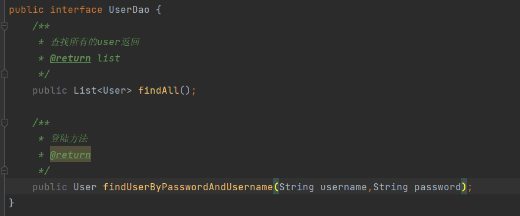

# 综合联系
1.简单的功能：
* 登录
* 列表查询
* 添加
* 删除
* 修改

2.负责功能
* 删除选中
* 分页查询
* 复杂条件进行分组查询

## 1、准备工作和登陆界面
之前我们做好了简单的案例，我们将资源拷贝过来。
### 1.1、界面调整

### 1.2、登陆页面


### 1.3、编写对应的servlet
loginServlet：检查登陆
CheckCodeServelt :生成验证码

相关字段：
```xml
 <form action="${pageContext.request.contextPath}/loginServlet" method="post">
        <div class="form-group">
            <label for="user">用户名：</label>
            <input type="text" name="username" class="form-control" id="user" placeholder="请输入用户名"/>
        </div>

        <div class="form-group">
            <label for="password">密码：</label>
            <input type="password" name="password" class="form-control" id="password" placeholder="请输入密码"/>
        </div>

        <div class="form-inline">
            <label for="vcode">验证码：</label>
            <input type="text" name="verifycode" class="form-control" id="verifycode" placeholder="请输入验证码" style="width: 120px;"/>
<%--            使用一个超链接来点击刷新验证码--%>
            <a href="javascript:refreshCode();">
                
            </a>
        </div>
        <hr/>
        <div class="form-group" style="text-align: center;">
            <input class="btn btn btn-primary" type="submit" value="登录">
        </div>
    </form>
```

修改数据库表，添加username和password字段：

### 1.4、代码实现相关功能

```xml
 <!-- 出错显示的信息框 -->
    <div class="alert alert-warning alert-dismissible" role="alert">
        <button type="button" class="close" data-dismiss="alert" >
            <span>&times;</span>
        </button>
        <strong>${requestScope.login_msg}</strong>
    </div>


```
在loginServlet.java:

```java
//在登陆的servlet里面
//验证码不成功通过
//给提示信息，
request.setAttribute("login_msg","验证码错误！");
//重定向到登陆界面，不给登录成功界面
request.getRequestDispatcher("/login.jsp").forward(request,response);
```

之后在UserDao里面添加登陆功能，用于查询user是否存在，存在则返回。注意接口里面需要添加对应的方法。



然后完善登陆功能。

## 2、实现添加功能


点击添加跳转到add.jsp，然后填完数据，数据提交到addUserServlet来处理：

addUserServlet里面调用服务层代码


## 3、实现删除功能

deleUserServlet

```xml
 <tr>
                <th><input type="checkbox"></th>
                <td>${list.count}</td>
                <td>${user.name}</td>
                <td>${user.gender}</td>
                <td>${user.age}</td>
                <td>${user.address}</td>
                <td>${user.qq}</td>
                <td>${user.email}</td>
                <td><a class="btn btn-default btn-sm" href="update.html">修改</a>&nbsp;
                    <a class="btn btn-default btn-sm" href="${pageContext.request.contextPath}/delUserServlet?id=${user.id}">删除</a></td>
            </tr>
```


添加相关功能类。
功能完善，用户点击删除，为了防止误删，应该给与一个警告，要使用javaScript来实现。

```javascript
  function deleteUser(id){
    if(confirm("确定要删除用户吗？")){
        //是的话，将该标签的href定向
        location.href = "${pageContext.request.contextPath}/delUserServlet?id="+id;
    }
}
<a class="btn btn-default btn-sm" href="javascript:deleteUser(${user.id})">删除</a></td>

```

## 4、修改功能
修改同删除类似，我们需要编写对应的方法，类


我们需要实现点击修改，跳转之后将原来的数据回显:
然后再实现点击提交实现修改，之后重定向到跳转list信息页面。
```javascript
 <div class="form-group">
            <label >性别：</label>
              <c:if test="${requestScope.userInfo.gender.equals('男')}">
                  <input type="radio" name="gender" value="男" checked />男
                  <input type="radio" name="gender" value="女"  />女
              </c:if>
              <c:if test="${requestScope.userInfo.gender.equals('女')}">
                  <input type="radio" name="gender" value="男"  />男
                  <input type="radio" name="gender" value="女" checked />女
              </c:if>

          </div>
```

之后点击提交，到UpdateUserServlet，完事之后，重定向到ListUserServlet

```java
     Map<String, String[]> parameterMap = request.getParameterMap();
        User user = new User();

        try {
            BeanUtils.populate(user,parameterMap);
        } catch (IllegalAccessException | InvocationTargetException e) {
            e.printStackTrace();
        }
        UserService userService = new UserServiceImpl();
        userService.updateUser(user);
        //这里不要用重定向，不会触发查询所有信息的
//        response.sendRedirect(request.getContextPath()+"/list.jsp");
        response.sendRedirect(request.getContextPath()+"/UserListServlet");
//而转发不要添加request.getContextPath()
//        request.getRequestDispatcher("/list.jsp").forward(request,response);
```
## 5、删除选中功能（复杂功能）
1、如何获取选中的项目的id？利用一个表单包裹table，表单默认会给我们提交数据，这是一个取巧的方法
但是我们需要在删除选中按钮上绑定对应的事件。

```javascript
  window.onload = new function (){
            document.getElementById("deleteSelected").onclick = new function (){
                document.getElementById("userInfoList").submit();//触发表单提交数据
            }
        }


<a class="btn btn-primary" href="javascript:void(0)" id="deleteSelected">删除选中</a>
```


我们可以在浏览器上调试，看是否将id传过去：
注意到上面写了new发现这样是不对的，new是全局性的。


有了uid，我们就可以来尝试删除了。但是我们需要添加一个确认按钮。同时给全选功能实现：
```javascript

window.onload =  function () {
    document.getElementById("deleteSelected").onclick = function () {
        if (confirm("真的要删除选中数据吗？")) {
            var flag = false;
            //判断是否有选中条目
            var cbs = document.getElementsByName("uid");
            for (var i = 0; i < cbs.length; i++) {
                if (cbs[i].checked) {
                    //有一个条目选中了
                    flag = true;
                    break;
                }
            }
        }
        if (flag) {//有条目被选中
            //表单提交
            document.getElementById("userInfoList").submit();
        }
    }
    //1.获取第一个cb
    document.getElementById("firstCk").onclick = function(){
        //2.获取下边列表中所有的cb
        var cbs = document.getElementsByName("uid");
        //3.遍历
        for (var i = 0; i < cbs.length; i++) {
            //4.设置这些cbs[i]的checked状态 = firstCb.checked
            cbs[i].checked = this.checked;
        }

    }
}
```

## 6、分组查询功能&分页查询功能

1、分页查询功能


* 封装PageBean

在domain包下新增对应的类

* 分析实现的具体步骤

* 实现

2、分组查询功能
```sql
select * from user like %xxx% and like %xxx% limit 0,5;
```


查询条件也要回显：

当执行条件查询，点击分页，出现bug，需要修复。就是点击的链接上添加上查询参数。

之后维修相关bug
如UserListServelt中：
```java
  @Override
    protected void doPost(HttpServletRequest request, HttpServletResponse response) throws ServletException, IOException {
            //1、调用UserService——service业务逻辑层提供的一个接口层完成查询
        UserService userService = new UserServiceImpl();
        List<User> userList = userService.findAll();
        System.out.println("userList个数："+userList.size());
        PageBean<User> pageBean = new PageBean<>();
        pageBean.setTotalCount(userList.size());
        pageBean.setRow(5);
        pageBean.setCurrentPage(1);
        //计算总的页码
        int res = userList.size() % 5;
        int totalPage = res ==0?userList.size()/5:userList.size()/5+1;
        pageBean.setTotalPages(totalPage);
        //2、将userList存入request域
        request.setAttribute("pageBean",pageBean);

        //3、转发到list.jsp
        request.getRequestDispatcher("/list.jsp").forward(request,response);
    }
```


